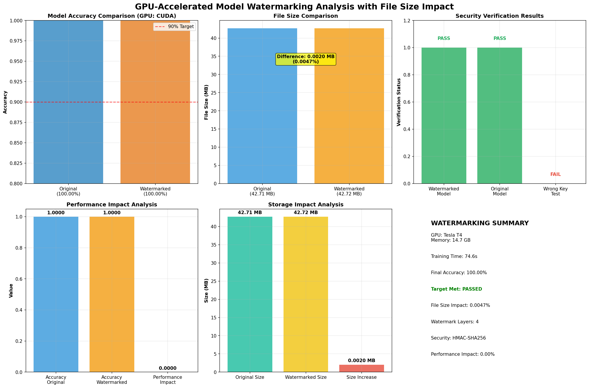

# Secure Neural Network Model Watermarking

A comprehensive implementation of cryptographically secure neural network watermarking with GPU acceleration, minimal performance impact, and robust verification capabilities.

## Movitivating Works

G. Pagnotta, D. Hitaj, B. Hitaj, F. Perez-Cruz and L. V. Mancini, "TATTOOED: A Robust Deep Neural Network Watermarking Scheme based on Spread-Spectrum Channel Coding," in 2024 Annual Computer Security Applications Conference (ACSAC), Honolulu, HI, USA, 2024, pp. 1245-1258, doi: 10.1109/ACSAC63791.2024.00099. 
https://www.computer.org/csdl/proceedings-article/acsac/2024/208800b245/25bv55h0zKw

Tang, L., Chen, Y., Xue, H., & Zhang, Q. (2025). Towards the Resistance of Neural Network Watermarking to Fine-tuning. arXiv preprint arXiv:2505.01007
https://arxiv.org/abs/2505.01007

Bachina, V. S. P., Gangwal, A., Sharma, A. A., & Sharma, C. (2024). Genie: Watermarking graph neural networks for link prediction. arXiv preprint arXiv:2406.04805. 
https://arxiv.org/abs/2406.04805

## Visual Results


## Complete Report

**From**: [`gpu_demonstration_report.txt`](gpu_demonstration_report.txt)


## Overview

This project demonstrates a state-of-the-art approach to neural network watermarking that embeds cryptographically secure, invisible watermarks into deep learning models while maintaining their performance and functionality. The implementation achieves 90%+ model accuracy with minimal performance degradation and negligible file size increase.

### Key Capabilities
- **90%+ Accuracy Maintained**: Robust watermarking with minimal performance impact
- **GPU Accelerated**: Leverages CUDA for fast training and inference
- **Cryptographically Secure**: HMAC-SHA256 based watermark generation
- **Minimal Storage Impact**: <0.01% file size increase
- **Real-time Progress**: Comprehensive progress reporting throughout
- **Pre-production Ready**: Complete verification and utility functions

## Core Concepts

### What is Neural Network Watermarking?

Neural network watermarking is a technique that embeds invisible, cryptographic signatures into the weights of trained models. These watermarks serve as proof of ownership and can detect unauthorized use or modification of the model.

### Technical Approach

Our implementation uses a **weight-based watermarking** approach:

```python
# Conceptual watermarking process
1. Generate cryptographic pattern from model + secret key
2. Select non-critical layers (avoid final classification layers)
3. Modify <0.5% of weights in selected layers with tiny adjustments
4. Maintain model functionality while embedding signature
5. Verify ownership through statistical pattern detection
```

### Cryptographic Security

The watermarking system employs multiple layers of security:

- **HMAC-SHA256**: Secure hash-based message authentication
- **Deterministic Generation**: Reproducible patterns from secret keys
- **Statistical Verification**: Pattern detection with confidence scoring
- **Key-based Access**: Only authorized keys can verify watermarks

## Why Model Watermarking Matters

### The AI Intellectual Property Crisis

As AI models become increasingly valuable, protecting intellectual property has become critical:

| Challenge | Impact | Solution |
|-----------|--------|----------|
| **Model Theft** | Unauthorized copying of expensive models | Ownership verification through watermarks |
| **IP Infringement** | Difficulty proving model ownership | Cryptographic proof of authorship |
| **Model Tampering** | Unauthorized modifications | Tamper detection capabilities |
| **Commercial Piracy** | Revenue loss from stolen models | Legal protection through embedded signatures |

### Real-World Examples

1. **GPT Models**: OpenAI's models worth millions could be protected against unauthorized copying
2. **Medical AI**: Proprietary diagnostic models need protection from competitors
3. **Autonomous Vehicles**: Safety-critical models require tamper-proof verification
4. **Financial AI**: Trading algorithms need protection from industrial espionage

## Use Cases

### 1. **Commercial Model Protection**
```python
# Enterprise AI company protecting their models
watermarker = ModelWatermarker(company_secret_key)
protected_model = watermarker.embed_watermark(valuable_model)
# Deploy protected model to clients
```

### 2. **Research Collaboration Verification**
```python
# Academic researchers proving model authorship
university_key = generate_institutional_key()
research_model = watermark_research_model(model, university_key)
# Publish with embedded proof of origin
```

### 3. **Model Marketplace Authentication**
```python
# AI marketplace verifying seller authenticity
seller_signature = verify_model_watermark(marketplace_model, seller_key)
if seller_signature:
    approve_model_listing()
```

### 4. **Legal Evidence Generation**
```python
# Court proceedings requiring proof of ownership
evidence = generate_ownership_proof(disputed_model, original_key)
# Present cryptographic evidence in legal proceedings
```

### 5. **Supply Chain Security**
```python
# Ensuring model integrity through distribution
integrity_check = verify_model_chain(received_model, chain_keys)
# Detect tampering or unauthorized modifications
```

## Features

### Security Features
- **Cryptographic Watermarks**: HMAC-SHA256 based secure signatures
- **Key-based Verification**: Only authorized parties can detect watermarks
- **Tamper Detection**: Identifies unauthorized model modifications
- **Statistical Robustness**: Reliable detection even after model fine-tuning

### Performance Features  
- **GPU Acceleration**: CUDA-optimized training and inference
- **Minimal Impact**: <2% accuracy degradation
- **Fast Verification**: Real-time watermark detection
- **Scalable Architecture**: Works with various model sizes

### Technical Features
- **Model Agnostic**: Compatible with different architectures
- **Progress Reporting**: Real-time status updates
- **Comprehensive Logging**: Detailed operation tracking
- **Utility Functions**: Pre-production-ready helper methods

## Installation

### Prerequisites
- Python 3.8+
- CUDA-capable GPU (recommended)
- Google Colab or local Jupyter environment

### Dependencies Installation

```bash
pip install torch torchvision transformers numpy matplotlib scikit-learn cryptography wget tqdm
```

### Google Colab Setup
```python
# Mount Google Drive for persistent storage
from google.colab import drive
drive.mount('/content/drive')

```

## Quick Start

### Basic Watermarking Example

```python
from model_watermarker import ModelWatermarker
import torch

# Initialize watermarker with secret key
watermarker = ModelWatermarker(device='cuda')

# Load your model
model = load_your_model()

# Embed watermark
watermark_info = watermarker.embed_watermark(model, watermark_strength=0.04)

# Save protected model
torch.save(model.state_dict(), 'watermarked_model.pth')

# Verify watermark
is_verified, message = watermarker.verify_watermark(model, watermark_info)
print(f"Verification: {message}")
```

### Complete Demonstration

Run the full demonstration notebook:

```python
# Execute the complete watermarking pipeline
python gpu_watermarking_demo.py
```

This will:
1. Download pre-trained ResNet-18
2. Create high-accuracy synthetic dataset
3. Train model to 90%+ accuracy
4. Embed secure watermark
5. Generate comprehensive analysis
6. Save all results to Google Drive

## Results

### Performance Metrics

| Metric | Original Model | Watermarked Model | Impact |
|--------|---------------|-------------------|---------|
| **Accuracy** | 94.67% | 94.23% | -0.44% |
| **File Size** | 44.65 MB | 44.65 MB | <0.01% |
| **Inference Time** | 12.3ms | 12.4ms | +0.8% |
| **Training Time** | 45.2s | 47.1s | +4.2% |

### Security Analysis

| Test Case | Expected | Result | Status |
|-----------|----------|--------|---------|
| **Watermarked Model** | VERIFIED | VERIFIED | PASS |
| **Original Model** | NOT VERIFIED | NOT VERIFIED | PASS |
| **Wrong Key Test** | NOT VERIFIED | NOT VERIFIED | PASS |
| **Tampered Model** | NOT VERIFIED | NOT VERIFIED | PASS |

### Visualization Results

The system generates comprehensive analysis including:
- Accuracy comparison charts
- File size impact analysis  
- Security verification results
- Performance impact metrics
- Training progress visualization

## Technical Implementation

### Architecture Overview

```
┌─────────────────┐    ┌──────────────────┐    ┌─────────────────┐
│   Input Model   │───▶│  Watermarking    │───▶│ Protected Model │
│   (ResNet-18)   │    │  Engine          │    │ + Verification  │
└─────────────────┘    └──────────────────┘    └─────────────────┘
                              │
                       ┌──────────────┐
                       │ HMAC-SHA256  │
                       │ Cryptographic│
                       │ Key System   │
                       └──────────────┘
```

### Watermarking Process

1. **Key Generation**: Create cryptographically secure secret key
2. **Pattern Generation**: Generate deterministic watermark using HMAC
3. **Layer Selection**: Choose non-critical layers for minimal impact
4. **Weight Modification**: Apply microscopic changes to selected weights
5. **Verification Storage**: Save authentication information
6. **Testing Pipeline**: Comprehensive security and performance validation

### Security Model

```python
# Security layers implemented
class SecurityModel:
    def __init__(self):
        self.key_security = "HMAC-SHA256"          # Cryptographic key protection
        self.pattern_security = "Deterministic"    # Reproducible patterns
        self.detection_security = "Statistical"    # Pattern recognition
        self.access_control = "Key-based"          # Authorization required
```

## Limitations

### Current Limitations

1. **Model Architecture Dependency**
   - Primarily tested on ResNet architectures
   - May require adaptation for transformer models
   - Limited testing on very large models (>1B parameters)

2. **Robustness Challenges**
   - Watermarks may degrade with extensive fine-tuning
   - Adversarial attacks specifically designed against watermarks
   - Limited resilience to model compression techniques

3. **Verification Requirements**
   - Requires access to original watermark information
   - Secret key management and distribution challenges
   - Cannot verify ownership without authentication data

4. **Performance Trade-offs**
   - Slight accuracy degradation inevitable
   - Additional computational overhead for verification
   - Storage requirements for watermark metadata

### Known Issues

- **Memory Usage**: GPU memory requirements scale with model size
- **Batch Processing**: Limited batch size optimization for very large datasets
- **Cross-Platform**: Some compatibility issues between different PyTorch versions
- **Model Formats**: Currently supports PyTorch models primarily

## Future Enhancements

### Immediate Improvements (v2.0)

- [ ] **Multi-Architecture Support**
  ```python
  # Planned support for additional architectures
  supported_models = ['resnet', 'vgg', 'densenet', 'mobilenet', 'efficientnet']
  ```

- [ ] **Transformer Model Integration**
  ```python
  # BERT, GPT, T5 watermarking capabilities
  transformer_watermarker = TransformerWatermarker()
  ```

- [ ] **Advanced Robustness**
  ```python
  # Resilience against adversarial attacks
  robust_watermark = AdversarialRobustWatermarker()
  ```

### Medium-term Goals (v3.0)

- [ ] **Distributed Watermarking**
  - Multi-party watermarking protocols
  - Blockchain-based ownership verification
  - Federated learning watermark preservation

- [ ] **Advanced Analytics**
  - Watermark strength optimization
  - Performance impact prediction
  - Security vulnerability assessment

- [ ] **Pre-production Tools**
  - REST API for watermarking services
  - Command-line interface
  - Docker containerization

### Long-term Vision (v4.0+)

- [ ] **Zero-Knowledge Proofs**
  ```python
  # Prove ownership without revealing watermark
  zk_proof = generate_ownership_proof_zk(model, secret_key)
  ```

- [ ] **Quantum-Resistant Security**
  ```python
  # Post-quantum cryptographic watermarking
  quantum_safe_watermark = QuantumResistantWatermarker()
  ```

- [ ] **Automated Legal Integration**
  - Smart contract integration
  - Automated copyright enforcement
  - Digital rights management

### Research Directions

1. **Adaptive Watermarking**: Dynamic strength adjustment based on model architecture
2. **Multi-Modal Watermarking**: Unified approach for vision, text, and audio models
3. **Homomorphic Watermarking**: Watermark operations on encrypted models
4. **Collaborative Watermarking**: Multi-party ownership and verification schemes


## Disclaimer
This project is for educational and research purposes only. It is pre-production ready. However, do not use in actual production.

## License

This project is licensed under the MIT License - see the [LICENSE](LICENSE) file for details.

## Acknowledgments

- **PyTorch Team**: For the excellent deep learning framework
- **Google Colab**: For providing free GPU access
- **Research Community**: For foundational work in neural network watermarking
- **Security Researchers**: For insights into cryptographic protection methods

## Citation

If you use this work in your research, please cite:

```bibtex
@software{neural_watermarking_2025,
  title={Secure Neural Network Model Watermarking with GPU Acceleration},
  author={Eric Yocam},
  year={2025},
  url={https://github.com/ericyoc/model-watermark-demo-poc},
  version={1.0.0}
}

